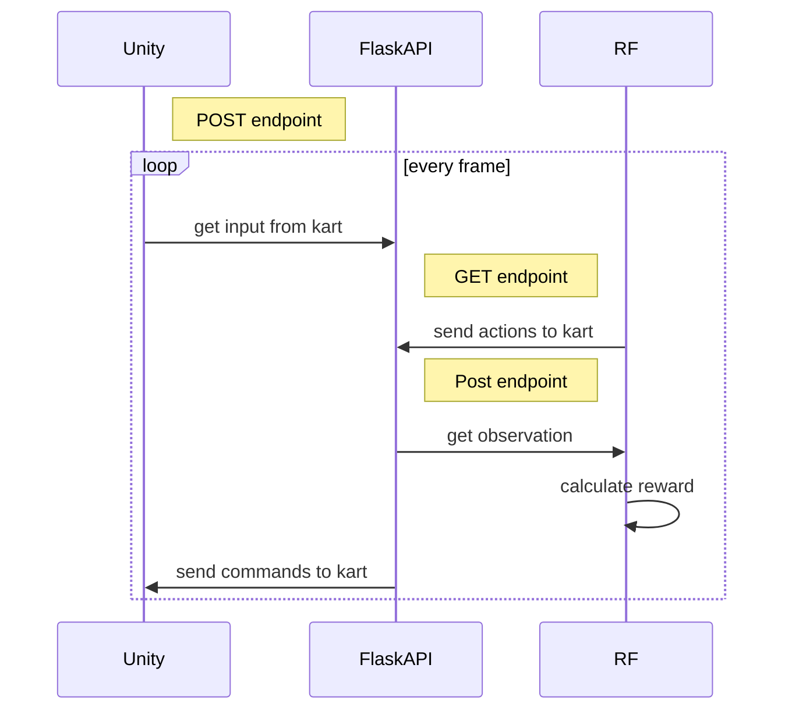

```mermaid
sequenceDiagram
participant Unity
    participant FlaskAPI
    Note right of Unity: POST endpoint
    loop every frame
        Unity->>FlaskAPI: get input from kart
        Note left of RF: GET endpoint
        RF->>FlaskAPI: send actions to kart
        Note left of RF: Post endpoint
        FlaskAPI->>RF: get observation
        RF->>RF: calculate reward
        FlaskAPI->>Unity: send commands to kart
    end
   

```